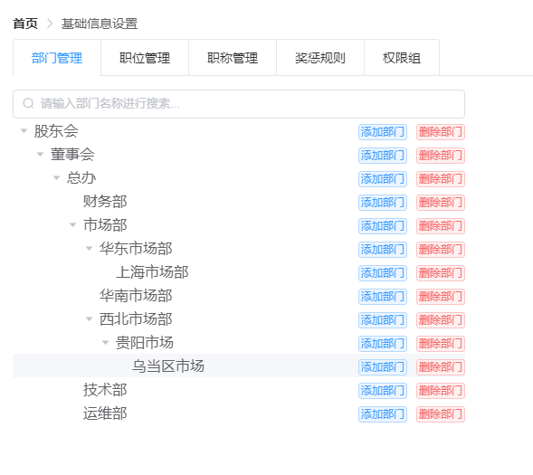
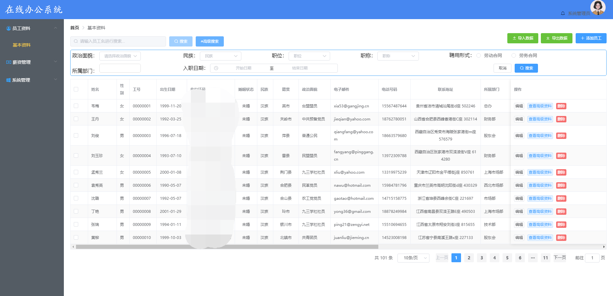
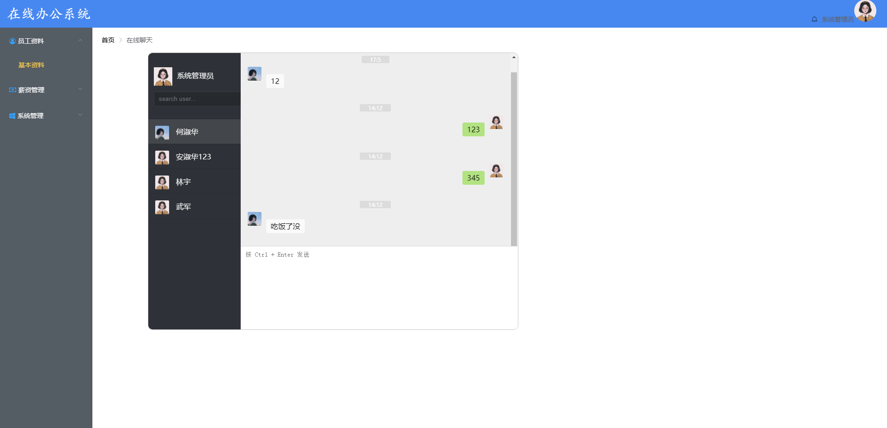

<h1 align="center"> office &nbsp; 🚀 &nbsp; 在线办公系统  </h1>
<h3 align="center">改造bilibili上“云e办”项目~</h3>

​    
    
    
    
    

---

>项目采用前后端分离开发模式，包括用户管理，角色管理，权限管理，部门管理，职位管理，职称管理，员工资料，薪资管理，个人中心，在线聊天等模块。

###  [后端项目](https://github.com/smallpleasures/office "后端项目") & [前端项目](https://github.com/smallpleasures/office-vue "前端项目")

#### 模块划分

- office-server: 业务模块,所有与业务相关的代码放在此工程中。
- office-generator: 采用Mybatis-Plus代码生成器，生成Controller,Service,ServiceImpl,Mapper,Mapper.xml，pojo。

#### 技术栈

注意：项目未用到redis，验证码，fastdfs，云存储等技术，运行起来看效果比较容易

#### 项目运行

后端：sql文件导入数据库后，启动项目

接口文档：localhost:8081/doc.html

前端：执行npm  install后，npm run serve运行项目即可，登录密码123

#### 演示页面

后台系统登录页面

首页

用户管理

权限管理

部门管理

员工资料

在线聊天

### 交流

交流，我的email是yrainy2021@163.com

